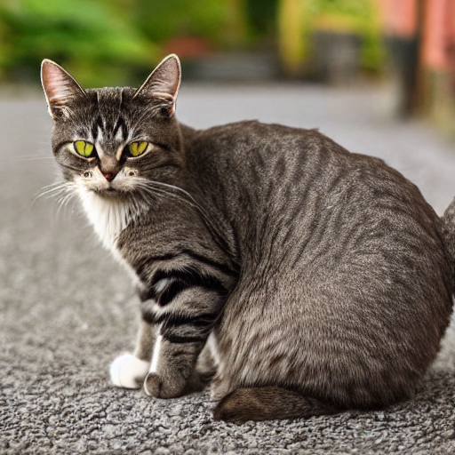

# 🧠 Image Generation from Text using Stable Diffusion

This project is submitted as **Task 2** for the **Prodigy Internship**. It demonstrates how to use a pre-trained generative model (Stable Diffusion) to create visually coherent images from natural language prompts.

---

## 🚀 Task Description

> **Task 2**: Utilize pre-trained generative models like DALL·E-mini or Stable Diffusion to create images from text prompts.

I used the **Stable Diffusion v1.4 model** from Hugging Face for this task.

---

## 📂 Files in This Repo

| File | Description |
|------|-------------|
| `prodigy_ga_02.ipynb` | Main Colab notebook for image generation |
| `generated_image.png` | Sample image generated from a text prompt |
| `README.md` | Project overview |
| `requirements.txt` | Required libraries for this project |

---

## ✨ Sample Prompt and Output

**Prompt: A cat**

**Generated Image:**

---

## 📦 Libraries Used

- `diffusers`
- `transformers`
- `torch`
- `safetensors`
- `scipy`

See `requirements.txt` for full list.

---

## 🛠 How to Run the Notebook

1. Open [Google Colab](https://colab.research.google.com)
2. Upload and open `prodigy_ga_02.ipynb`
3. Run all cells (make sure GPU is enabled: Runtime → Change Runtime Type → GPU)
4. Enter your own text prompts and generate images!

---

## 🙋‍♀️ Author

**Reva Pande**  
B.Tech CSE (AI) @ IGDTUW  
[LinkedIn](https://linkedin.com/in/revapande) | [GitHub](https://github.com/revapande)

---

## ⭐️ Star this repo if you found it helpful!

